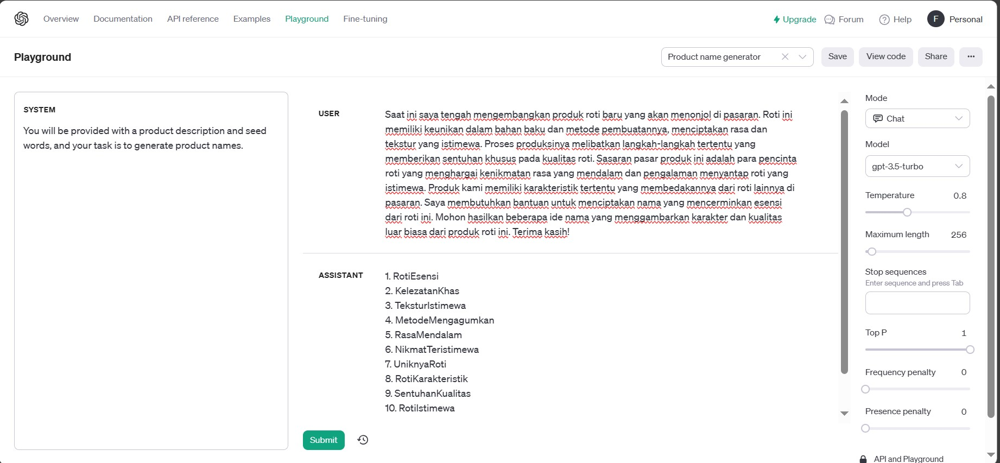

# Introduction to Artificial Intelligence

## Playground Examples

> ### Product Name Generator

-   #### Input

```
Saat ini saya tengah mengembangkan produk roti baru yang akan menonjol di pasaran.
Roti ini memiliki keunikan dalam bahan baku dan metode pembuatannya, menciptakan rasa dan tekstur yang istimewa.
Proses produksinya melibatkan langkah-langkah tertentu yang memberikan sentuhan khusus pada kualitas roti
Sasaran pasar produk ini adalah para pencinta roti yang menghargai kenikmatan rasa yang mendalam
dan pengalaman menyantap roti yang istimewa.
Produk kami memiliki karakteristik tertentu yang membedakannya dari roti lainnya di pasaran.
Saya membutuhkan bantuan untuk menciptakan nama yang mencerminkan esensi dari roti ini.
Mohon hasilkan beberapa ide nama yang menggambarkan karakter dan kualitas luar biasa dari produk roti ini.
Terima kasih!
```

-   #### Ouput

```
1. RotiEsensi
2. KelezatanKhas
3. TeksturIstimewa
4. MetodeMengagumkan
5. RasaMendalam
6. NikmatTeristimewa
7. UniknyaRoti
8. RotiKarakteristik
9. SentuhanKualitas
10. RotiIstimewa
```

-   #### Screenshots


